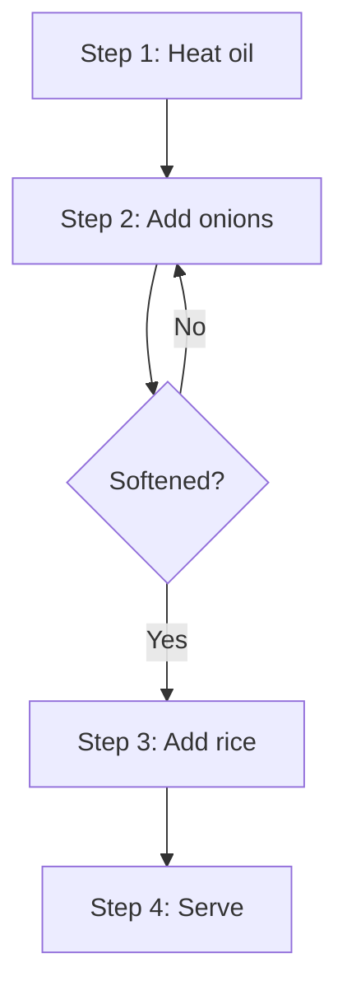

# Frontend

Next.js 16 (App Router, TypeScript, Tailwind CSS, Mermaid).

Production: `https://recipe-poly-one.vercel.app`
Local dev: `http://localhost:3001`

API base URL is read from `NEXT_PUBLIC_API_BASE_URL` (default `https://recipe-poly.vercel.app/api`).

## Pages

### `/` — Home: Recommendation Engine

- Four sliders: `speed`, `minimalPrep`, `protein`, `lowCalorie`. Each maps 0–100 → 0..1.
- Preset buttons: Balanced, Quick & Easy, High Protein, Low Calorie.
- Guest overlay: floating panel showing current vector; no login required.
- Results grid: cards with image, title, similarity percentage.

Data flow:

1. Slider change updates local `preferences` vector.
2. Debounced 500 ms → `POST /api/recommendations`.
3. Response renders cards; card click navigates to `/recipe/[slug]`.

### `/recipe/[slug]` — Recipe Detail

- **Serving scaler**: quantities displayed per serving; stepper updates all scaled quantities client-side. Non-scalable units (e.g. `pinch`) remain fixed with a note.
- **Mermaid step graph**: `instructions` JSONB step DAG is rendered as a Mermaid flowchart. Decision nodes come from steps with a `condition` field; loops are represented by back edges.

Example generated Mermaid:

Fallback: numbered list if Mermaid parse fails.

### `/search` — Full-text search (planned)

### `/about` — Project info

## API Client

All calls go through `src/lib/api-client.ts`. The client:
- Prefixes `NEXT_PUBLIC_API_BASE_URL`.
- Unwraps the `{ success, data | error }` envelope.
- Throws a typed error for `success: false`.

## Envelope Handling

Backend always returns `{ success: true, data }` or `{ success: false, error: { message, code } }`. Components never read the raw response directly.

## Notes

- Serving scaling is **client-side**; the API accepts a `servings` param for legacy compatibility only.
- Mermaid is loaded lazily per recipe detail page.
- Recipe IDs are UUID v4.
